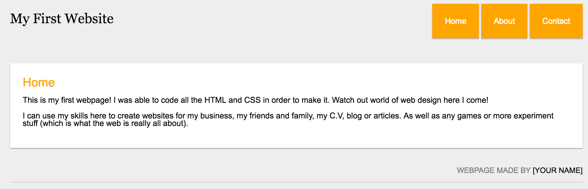

# 練習範例

## 成果預覽

## 範例說明

以下是製作本次練習範例需要使用到的素材

This is my first webpage! I was able to code all the HTML and CSS in order to make it. Watch out world of web design here I come!
I can use my skills here to create websites for my business, my friends and family, my C.V, blog or articles. As well as any games or more experiment stuff (which is what the web is really all about). 