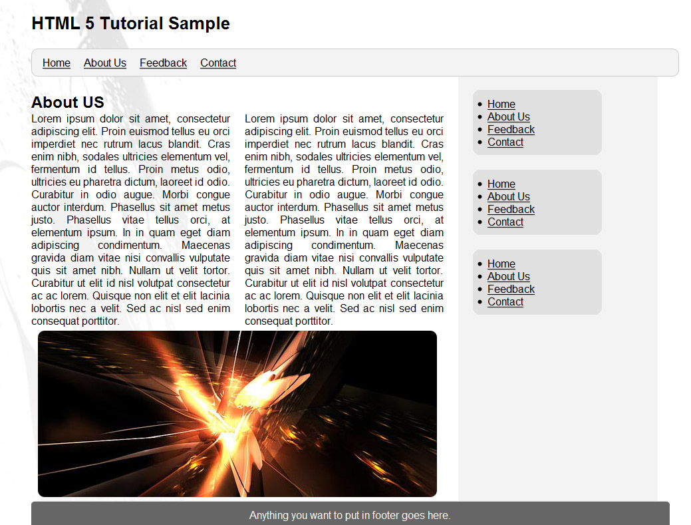

# 練習範例 2

## 成果預覽



## 範例說明

1. 本次案例使用到 HTML5 新設的網頁元素，請先參閱講義[HTML 元素](ch2/HTML_Elements.md)的「排版」一節，先瞭解 `<header>`、`<nav>`、`<footer>`、`<aside>` 等網頁元素的定義。
2. 請先[下載範例檔案](html-5-tutorial.html)。
3. 在 `<header>` 元素內加入標題文字 `HTML 5 Tutorial Sample`
4. 在 `<nav>` 元素內加入選單項目，即圖示中的 `Home`、`About`、`Feedback` 及 `Contact` 等項目。
5. 在 `<section>` 元素內加入「About US」的內容及圖檔。你可以使用下列的文字，直接複製、貼上兩次即可；至於圖片你可以在[這裡下載](images/test.jpg)。
6. 嘗試使用 CSS 套版。

```
Lorem ipsum dolor sit amet, consectetur adipiscing elit. Proin euismod tellus eu orci imperdiet nec rutrum lacus blandit. Cras enim nibh, sodales ultricies elementum vel, fermentum id tellus. Proin metus odio, ultricies eu pharetra dictum, laoreet id odio. Curabitur in odio augue. Morbi congue auctor interdum. Phasellus sit amet metus justo. Phasellus vitae tellus orci, at elementum ipsum. In in quam eget diam adipiscing condimentum. Maecenas gravida diam vitae nisi convallis vulputate quis sit amet nibh. Nullam ut velit tortor. Curabitur ut elit id nisl volutpat consectetur ac ac lorem. Quisque non elit et elit lacinia lobortis nec a velit. Sed ac nisl sed enim consequat porttitor.
```
